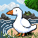
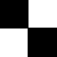

# 🎨 DarwinCanvas

> **A biologically-inspired Evolutionary Algorithm (EA) for vectorized image synthesis.**


## 📖 The Philosophy

**DarwinCanvas** is not your standard image generator. Unlike Neural Networks that learn to output pixel grids through backpropagation, DarwinCanvas relies on **Evolutionary Computing** to "grow" a painting stroke by stroke. 

By modeling the human artistic process, the algorithm starts with a blank canvas and applies broad, semi-transparent strokes to block out the core composition. Over thousands of generations, it evolves to refine its technique—applying smaller, sharper strokes to outline details and define edges. 

The result is a striking, vectorized recreation of a target image that actually looks like it was painted by a human.

---

## 🧬 Evolutionary Architecture (How It Works)

### 1. The Genome Representation
In DarwinCanvas, an individual's "DNA" is not a grid of RGB pixels, but a sequential array of vector strokes. 
* **The Genes:** Each stroke acts as a gene, characterized by precise mathematical properties: starting/ending coordinates $(x_1, y_1, x_2, y_2)$, thickness, color $(R, G, B)$, and alpha transparency.
* **The Painter's Algorithm:** Because the genome is sequential, the renderer evaluates the strokes back-to-front. This inherently allows the EA to "fix its mistakes" by evolving new strokes that paint over bad ones.

### 2. The Fitness Environment (Hybrid Vision)
To survive, an individual must closely resemble the target image. The environment evaluates fitness using a dynamic, weighted combination of two distinct computer vision metrics:
* **Structural Similarity Index (SSIM):** Rewards the preservation of structural layout, contrast, and high-frequency edge alignment.
* **CIELAB Delta-E:** Rewards perceptually accurate color matching in a human-calibrated color space.

*(Note: As the generations progress, the environment naturally shifts its weights, demanding better structural precision once the base colors are established.)*

### 3. Adaptive Mutation & Reproduction
DarwinCanvas employs isolated, single-action mutations to carefully map the fitness landscape without causing catastrophic forgetting:
* **Exploitation & Exploration:** Strokes can randomly jitter their parameters or completely new, randomized strokes can be added.
* **Stroke Mitosis:** A unique mutation where a long stroke dynamically splits into two connected segments. This allows the AI to "bend" strokes around corners and refine local details without destroying its existing composition.
* **Hybrid Crossover:** During reproduction, parents either undergo **Spatial Crossover** (stitching the left side of Parent A with the right side of Parent B) or **Blending Crossover** (stochastically mixing their stroke layers into a new, deeper canvas).

---

## 📸 Gallery

Watch the algorithm build structure from an empty canvas:

| Experiment | Target Image | Generated Art |
| :---: | :---: | :---: |
| **1. The Rubber Duck** |  |  |
| **2. Monochrome Shape** |  |  |

*(Note: Images are natively rendered at 64x64 and upscaled here for visibility)*

---

## 🛠️ Installation & Setup

Get up and running in a few simple steps:

**1. Clone the project**
```bash
https://github.com/arvindmeena232/DarwinCanvas-.git

```

**2. Install dependencies**
```bash
pip install -r requirements.txt
```

**3. Prepare your target**
Place a `64x64` target image in the `data/target/` directory. *(Note: By default, the script looks for `data/target/target64.jpg`.)*

---

## 🚀 Usage

Kick off the evolutionary engine by running the main module:

```bash
python -m src.main
```

As the generations progress, the AI will periodically save its best attempt to the `data/outputs/` directory. Check the console for live fitness tracking!
